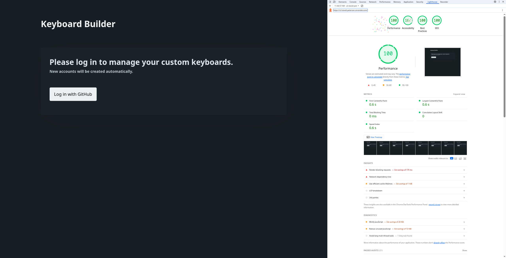
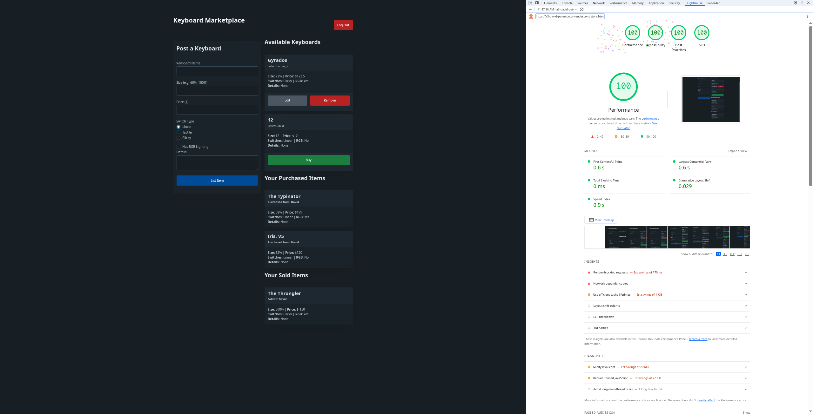

## Keyboard Marketplace

[The Super Cool Website](https://a3-david-peterson.onrender.com/)

**Goal:**
 A keyboard marketplace where users can list custom mechanical keyboards for sale, buy keyboards from others, and manage their listings. 

**Challenges:** 
I really wanted to have the ability to add images for the keyboards but I couldn't figure out a clean way to do that without introducing a new service which just felt wrong so I ended up making the listing text only. 
Also, I there may be a minor amount of HTML injection that is possible, but hey, I don't see anything against that on the rubric. :)

**Authentication Strategy:** 
GitHub OAuth via `passport-github2`. It's pretty minimal in terms of setup, not as bad I was expecting to be honest. 

**CSS Framework:** 
Pico.css. It has a very small footprint which helped me get a good performance score without having to use a service to minimize the css I send to the client.
I used custom CSS add more contrasting background colors on buttons so I could pass the lighthouse accessibility benchmark with 100%. I also used it randomly to remove some pretty ugly massive gaps between elements. There was probably a better way to do that, but I was tired of HTML.

### Technical Achievements (No Design, All technical)

* **(10 points) OAuth Authentication**: 
I used GitHub OAuth login using `passport` and `passport-github2`. 
Accounts are automatically created and stored in MongoDB upon first login. As such, I had to create a Github OAuth App.
* **(5 points) 100% Lighthouse Scores**: 
Lighthouse scores a 100 in Performance, Accessibility, Best Practices, and SEO.

  
Landing Page Lighthouse Score

  
  
Store Lighthouse Score

   

* **(5 points) 5 Express Middleware Packages**: 
  1. `helmet`: Sets HTTP response headers such as Content-Security-Policy and Strict-Transport-Security
  2. `compression`: Compresses response bodies to reduce sizes.
  3. `morgan`: HTTP request logs.
  4. `cors`: Cross-Origin Resource Sharing.
  5. `express-session`: Stores user session data.
  6. `passport` used for OAuth with Github.